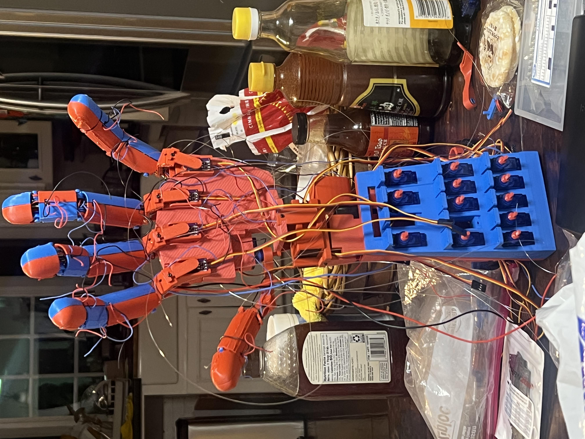
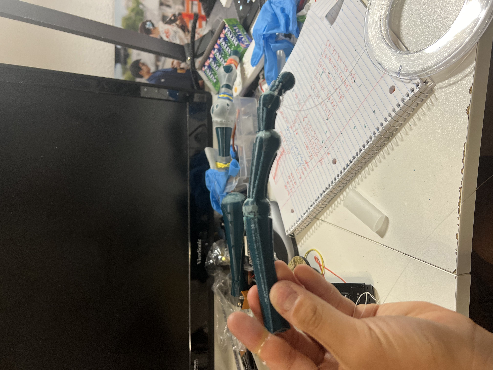
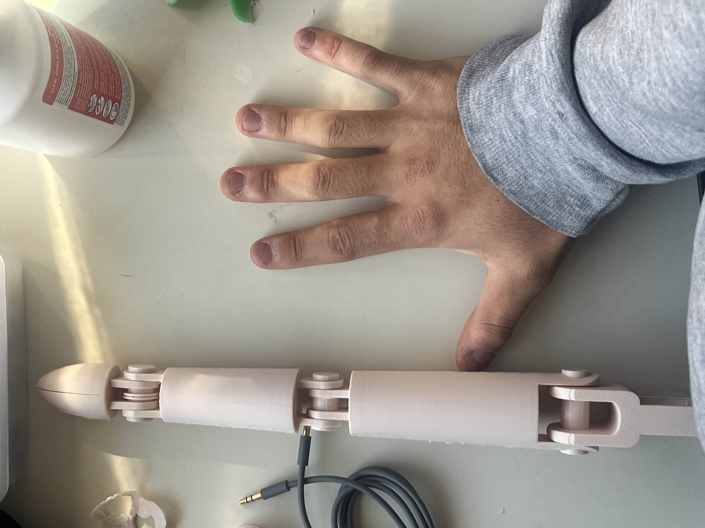
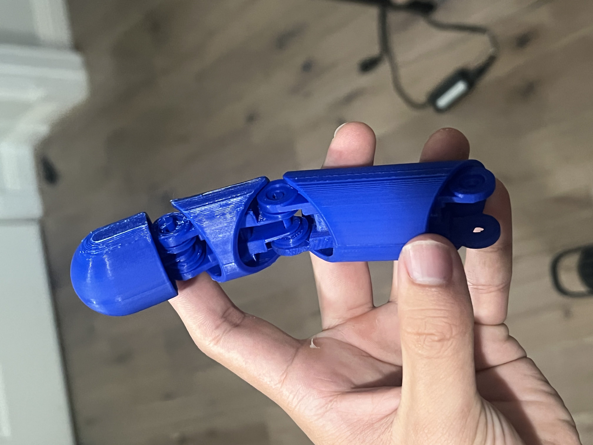
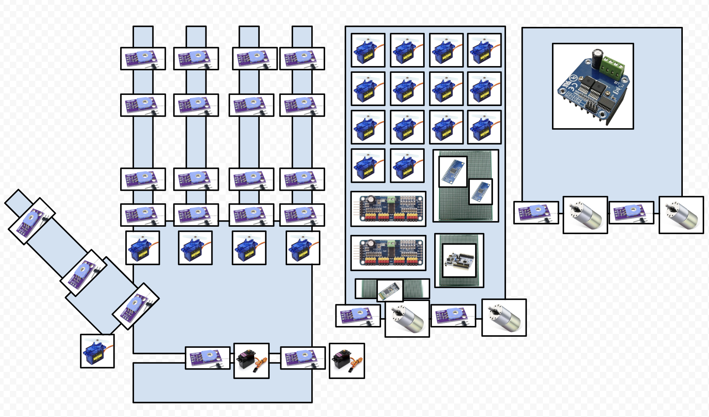
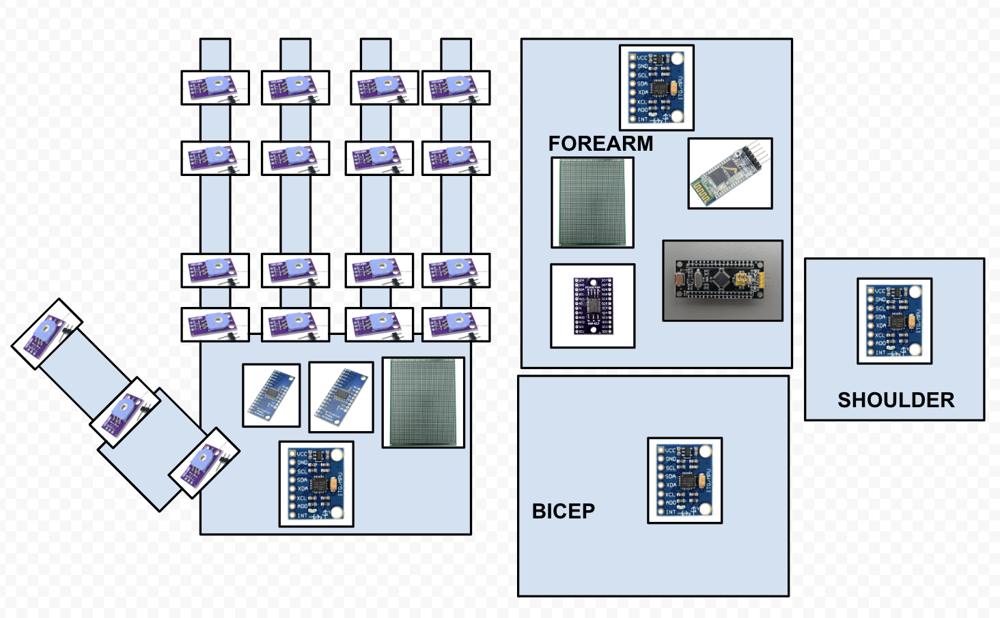

## L.E.B.R.O.N. Mark I – Project Recap & Improvement Roadmap
Date: 9/20/25

# Project Lead: Derek
# Firmware Side: Theo & Derek
# Mechanical Side: Vince, Kaden, & Nicholas

# Overview & Goals
The Limb Enabled for Bluetooth Remote Operation & Navigation (L.E.B.R.O.N.) is a 1.5x-scaled humanoid robotic arm, extending from the fingers to the shoulder. Our ambition was to replicate the dexterity, grip, and explosive movement required to dunk a basketball—specifically, mimicking the tomahawk dunks of LeBron James. The arm features a total of 26 joints:
- Fingers: 4 per finger (x4 fingers)
- Thumb: 3 joints
- Wrist: 3 joints
- Elbow: 1 joint
- Bicep: 1 joint
- Shoulder: 2 joints
Though real human arms have more degrees of freedom, we opted for this more common and achievable design, drawing inspiration from both professional and hobbyist robotic arms.

# Biomimetic Inspiration & Design Choices
I initially sought to closely mimic human anatomy, inspired by startups like Clone Robotics who replicate tendons, muscles, and bones for superior dexterity. My research began with studying NBA-sized hand dimensions and how grip force and hand surface area contribute to basketball handling.
Human finger motion is driven primarily by two tendons (flexor and extensor), but because robotic scale introduces major mechanical challenges (weight, complexity), we moved away from strict biological fidelity. Attempts to approximate the synovial fluid and nonrigid nature of real joints (e.g., finger fat, curved bones, thumb’s unique orientation) proved impractical at a 1.5x scale due to the limitations of available actuators and materials.
We leveraged air-powered "balloon muscles" early on, but actuator weight and bulk forced a pivot towards more conventional pulleys and servos. For palm and thumb movement, we mimicked the XY-plane articulation but struggled to recreate nuanced motions that aid in authentic basketball gripping.

# Here are some earlier finger prototypes

# Mechanical Design & Inspirations
We borrowed heavily from Will Cogley’s techniques, particularly his metacarpal “wag” joints and pulley system. Our finger actuation uses tensioned strings with servos, while larger joints utilize DC motors.
# Key Mechanical Challenges:
- Torque Requirements: With a fully extended length (forearm to fingertip) of 2 feet—plus bicep and shoulder, totaling up to 3.5 feet—the arm becomes unwieldy. Standard servos lacked the necessary torque; heavier DC motors added more weight, compounding the issue.
- Dexterity Limitations: 3D printed fingers lack the deformability of human fingers (fat, cartilage), impairing fine control and grip.
Palm & Thumb Mechanics: Recreating the palm’s natural divots and the thumb’s fluid range of motion proved difficult with rigid components and current joint designs.

# Electronics Architecture
The project's electronics evolved over several iterations. Initially focused on potentiometers and servos, our final system included:
- Flat Potentiometer Boards
- Servo Motors & Drivers
- ADC and I2C Multiplexers
- MPU6050 IMU Sensors
- DC Motors & Drivers
- UART Bluetooth Modules
- STM32F446RE & STM32F411 Microcontrollers
Our actuation system used servos for tensioning per-joint pulleys. Sensor feedback was delivered via arm sleeve potentiometers (again, a nod to Cogley’s workflows).
# Key Electrical Challenges:
- Insufficient Power: Hobby-grade 9g servos were lightweight but underpowered, only able to move the finger tips. Future revisions require stronger actuators.
Wiring Organization: Managing three wires per potentiometer plus fishing lines for tendons led to rapid disarray. Lack of preplanned wiring routes and harnesses compounded confusion.
- Power Distribution: Piecemeal circuit construction led to repeated issues blending independent module power supplies. Tracking current loads and properly configuring parallel voltages was time-consuming and error-prone.

# Software Architecture
I followed Artful Bytes’ project tutorials (though on MacOS, with STM32F446RE and STM32F411 Black Pill). While I didn’t copy his embedded libraries, his guidance around Makefiles, CI/CD workflow, Git usage, hardware-software memory interactions, debugging (addr2line, cppcheck, logic analyzers), and development process was invaluable.
# Operational Workflow:
- Master (STM32F411): Reads potentiometers/IMU on a wearable sleeve
- Bluetooth: Serialized angle data sent via UART
- Slave (STM32F446RE): Receives & deserializes angle data
- Actuation: Reads arm potentiometers, calculates difference, drives corresponding servos/DC motors
# Key Software Limitations:
- Teleoperation Speed: UART transmission is fast; deserialization is fast. Bottleneck occurs with servo actuation—moving all 26 joints per batch takes 1-2 seconds. Frequent data polling (every 50ms) overwhelms the RX buffer, and infrequent polling makes movements jerky and nonathletic. The current system can teleoperate but is far too slow for real-time fluid motion. This undermines the project's “dunking” goal.

## Improvement Focus Areas
# Mechanical
- Source/implement higher-torque, lower-weight actuators
- Investigate more biomimetic finger and palm construction, potentially hybridizing soft robotics principles (e.g., silicone, rubber, deformable structures)
- Revisit palm/thumb mechanics for more nuanced grasping and gripping
# Electrical
- Redesign wiring harnesses, plan cable management before build
- Design consolidated power architecture for ease of integration
- Invest in stronger, appropriately rated actuators for fingers and large joints
# Software
- Optimize servo control routines for speed (possibly parallelize or batch-move joints)
- Explore alternative wireless protocols to improve real-time data streaming
- Consider sensor fusion for smoother joint interpolation and response

# Closing Thoughts
Special thanks to Will Cogley and Artful Bytes for foundational mechanical/design and workflow insights. Next steps: Stronger actuators, improved biomimetic designs, and software optimizations for true athletic movement.
